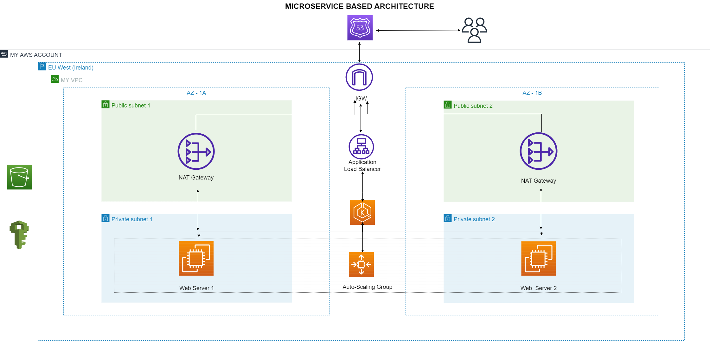
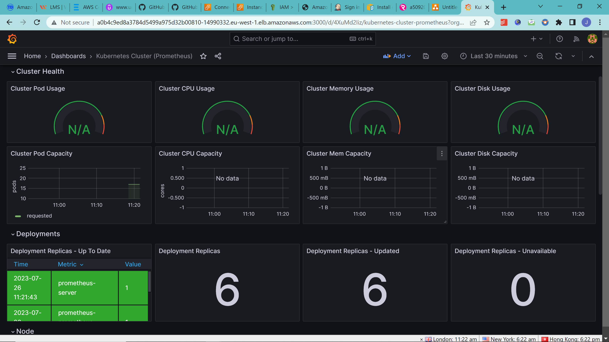

## Microservice Application with Helm

### Objective:
This documentation outlines the implementation and experiences during the design and implementation of TalentPlus take-home project for Microservice Architecture using Helm and DevOps pratices. The microservice architecture is an approach to building applications as a set of loosely coupled services, each responsible for a specific business capability. The purpose of this documentation is to highlight the problems and challenges faced during the adoption of the microservice architecture and explain how those challenges were overcome to achieve a scalable, maintainable, and resilient system.

### Overview of Microservice Architecture
The microservice architecture breaks down a monolithic application into smaller, autonomous services that can be developed, deployed, and scaled independently. Each microservice typically runs in its own container and communicates with other services through APIs, messaging systems, or service meshes. This architectural style enables agility, promotes scalability, facilitates better code maintainability, and allows teams to work independently on different services.

### Prerequisites:
1. An AWS account with sufficient permissions to create EKS clusters.

2. Terraform installed on your local machine (https://www.terraform.io/downloads.html).

3. AWS CLI configured with valid access and secret keys (https://docs.aws.amazon.com/cli/latest/userguide/cli-configure-quickstart.html).

Step-by-Step Setup:
 
Step 1: Infrastructure Implementation:
Set up the network stack using the provided Terraform codebases, including resources like EFS, instances, VPC stack, RDS, S3 bucket, DynamoDB, EKS cluster, IAM policies, and ACM.

Step 2: Initialize Terraform
Run the following command to initialize Terraform in the directory:
`terraform init`

Step 3: Plan Infrastructure
Run the following command to review the execution plan and verify the resources that will be created:
`terraform plan`

Step 4: Apply Infrastructure
Apply the Terraform configuration to create the archittecture:
`terraform apply --auto-approve`

Step 5: Access Outputs
After Terraform successfully applies the configuration, it will output important information, including the EKS cluster endpoint.

- To interact with the EKS cluster, configure kubectl with the EKS cluster credentials:
`aws eks --region <aws_region> update-kubeconfig --name <eks_cluster_name>`

### Problems and Challenges 

In the cause of the design and implementation of the Mciroservice, I encountered a number of challeneges and was able to overcome them by taking a step back to understand the major problem and how to overcome it.

- Deployment and Versioning
Coordinating the deployment of multiple services with different versioning strategies without causing service disruptions was a challenge.

- Data Consistency and Integrity
Maintaining data consistency across multiple services was a significant challenge. As data is distributed among microservices, ensuring its integrity, transactions, and referential integrity required careful consideration.

- Scalability and Performance
While the microservice architecture allows individual services to scale independently, determining the appropriate scaling metrics and handling inter-service communication bottlenecks were daunting tasks.

- Monitoring and Debugging
Monitoring the health of numerous microservices, tracing requests across services, and debugging issues were complex undertakings without a unified approach.

To solve all of this, I made use of DevOps tools and technologies for best pratices. I made sure I designed the architecture and then packaged it with Helm. Helm is a powerful package manager for Kubernetes, providing numerous benefits and simplifying the deployment and management of applications on Kubernetes clusters. 

Having done that, I wrote a Terraform infrastructure as Code script to make my codes re-usable and for easy deployment and versioning. 

All of these, couldn't have gone well without monitoring, hence, I implemented a monitoring stack using Prometheus and Grafana for this. This enabled me to have a proper insights about the health and well-being of the microservice architecture.
.png)

For automation purposes, I implemented a CI/CD pipeline using Jenkins. This reduced the deployment time and improved the overall system reliability.

I embraced container orchestration using Kubernetes, which enabled automated scaling based on predefined metrics. This ensured that each service could scale up or down based on demand.

Overall, I implemented thisusing LoadBalancer as my service type in my Kubernetes cluster, just for testing purposes, and I had a fully functioning webpage.

### Conclusion
The microservice architecture presented both challenges and opportunities for take-home project by TalentPlus. By addressing the issues of service discovery, data consistency, scalability, monitoring, deployment, and team organization, I was able to leverage the benefits of the microservice architecture effectively. This allowed to build a more resilient, scalable, and maintainable system.